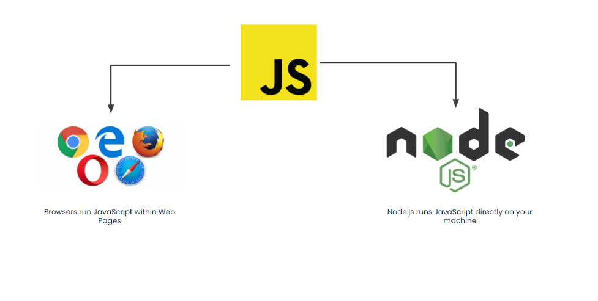

# JS in the Browser
We've been writing JavaScript using node.js. In this short session, we take a quick look at how we run JavaScript within the browser to prime us for the next module - building front end applications first with plain JavaScript and then with React.



## Including JavaScript with a Web Page
Like with CSS, we can include our JavaScript directly within our web page:

```html
<!DOCTYPE html>
<html lang="en">
 <head>
   <meta charset="UTF-8" />
   <title>Document</title>
   <script>
     console.log('Hello!');
   </script>
 </head>
 <body></body>
</html>
```

...Or store it in a separate file

```html
<!DOCTYPE html>
<html lang="en">
 <head>
   <meta charset="UTF-8" />
   <title>Document</title>
   <!-- Include index.js file! -->
   <script src="./index.js"> 
   </script>
 </head>
 <body></body>
</html>
```

*index.js*
```javascript
console.log('Hey there!');
```

Just like with CSS we will always use a separate file as that is considered best practice.

## Using the Console 
Remember the Developer Tools? We used it in HTML and CSS to inspect our elements, modify styles, test responsiveness and much more. The Developer Tools are also a fantastic tool for debugging JavaScript. When we used `console.log` in our node programs, we got messages in our terminal. In the browser, these `console.log` messages will appear in the Developer Tools in the Console tab. What's more, if we log an object or an array we can expand and collapse it's properties dynamically! Try this out:

```javascript
<!DOCTYPE html>
<html lang="en">
 <head>
   <meta charset="UTF-8" />
   <title>Document</title>
    <script>
      const bob = { name: 'bob', age :27 }
      const jane = { name: 'jane', age :31 }
      const people = [bob, jane]
      console.log(people)
   </script>
 </head>
 <body></body>
</html>
```

Open that file and then open your Developer Console - `[Chrome Menu] > More Tools > Developer Tools` and then select the `Console` tab. It should look something like this:


You might also notice you can type code in to the Console - this works exactly like the node REPL:


Try it out.

## Utilities
It's also possible from JavaScript in the browser to display a pop up directly to the user using the `alert` function:

```javascript
alert('hello!')
```

We can also capture information from the user with the `prompt` function!

```javascript
const name = prompt("what's your name?")
console.log("hello " + name)
```

Note that in reality, these functions are really just used for testing and debugging - they are not used to build real applications, but we'll use them for now while we get used to the browser environment.

### Wait, where do these functions come from?
These are functions available only within the browser environment. Interestingly, they are actually part of a **global** object called `window` that contains lots of other interesting information about the current browser window. **global** in this context essentially means "accessible from anywhere in our code." 

As always, you can read the documentation on [MDN](https://developer.mozilla.org/en-US/docs/Web/API/Window).

## Other Differences
There are many more differences between running code in the browser and through node. 

In node, we could do things like read a file from the hard drive - browsers don't let us do that. In the browser, we can manipulate the web page to add and remove elements dynamically. As we explore JavaScript in the browser we'll come across more differences - you don't need to be aware of all of these up front, but just remember they are two distinct JavaScript environments. The browser runs on the users machine, and node programs (usually!) run on the server. 

## Exercise Part 1
Practice writing JS in the browser with this small exercise:
* Creating a new javascript file, `index.js` and include it in the `index.html` file using a `script` tag.
* Inside your index.js file, write code to:
  - Show the user 4 random numbers between 1 and 100 using `alert`
  - Ask them to enter the numbers in the right order using `prompt`
  - Check how many numbers they entered correctly
  - Show the user their result

## Exercise Part 2
* Add your code in a function that will allow you to change the number of numbers displayed and asked for by just entering the desired number as an argument when calling the function - for example `playMemoryTest(4)`
- Run the function from the Developer Console with different values